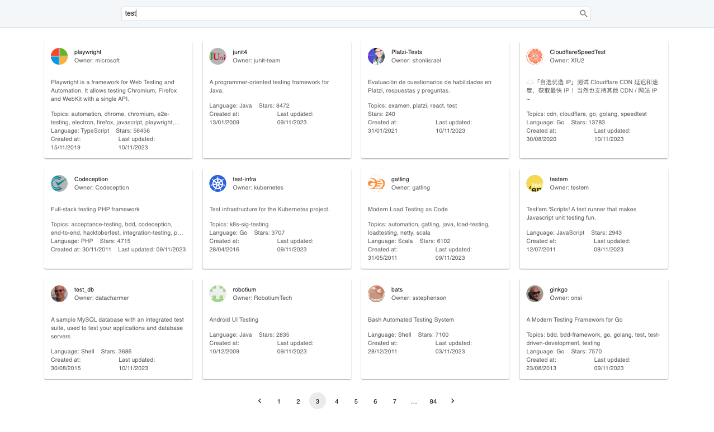

# Repository searcher with NextJS

<div>
  <p align="center">
    
  </p>
</div>

## Overview

You can see here the preview: https://search-repositories-joaquinbuxo.vercel.app/

In the image, we can see the expected result of the app when it is correctly installed. The image showcases the user interface of the app, displaying various components and interactions.

## Getting Started

### Prerequisites

- npm

### Installation

1. Clone the repository:

   ```sh
     git clone git@github.com:JoaquinBuxo/search-repositories.git
   ```

2. Install dependencies:

- catalogue : `cd search-repositories`

  ```sh
  npm install
  ```

3. Setup and start the app:

   ```sh
   npm run dev
   ```

4. Run unit tests:

   ```sh
   npm run test
   ```

5. Run e2e tests:

- First you will need to run the app (step 3) and then:

  ```sh
  npm run cypress
  ```

Open [http://localhost:3000](http://localhost:3000) with your browser to see the result.
